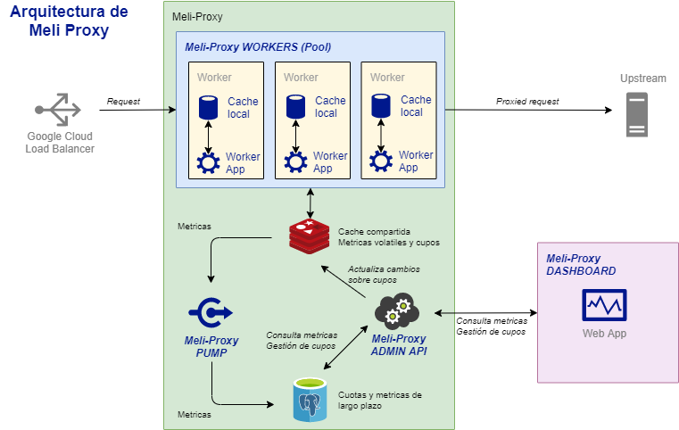

meli-proxy-dashboard
====================

Este es el dashboard del proyecto Meli-Proxy (https://github.com/martintama/meli-proxy)

Requisitos
----------

* PHP 7.3
* Apache / Nginx
* Composer

Instrucciones
-------------

* Clonar el proyecto
* Ejecutar `composer install`
* Configurar el sitio para que sea servido por apache/nginx, o bien ejecutar `bin/console server:start` desde el directorio

Notas
-----

El dashboard unicamente necesita conectarse al Admin API de Meli-Proxy para obtener las métricas, y gestionar los cupos (Quotas)

No tiene autenticación ya que se trata de un PoC

Arquitectura
-

Este componente es el Meli-Proxy DASHBOARD únicamente

